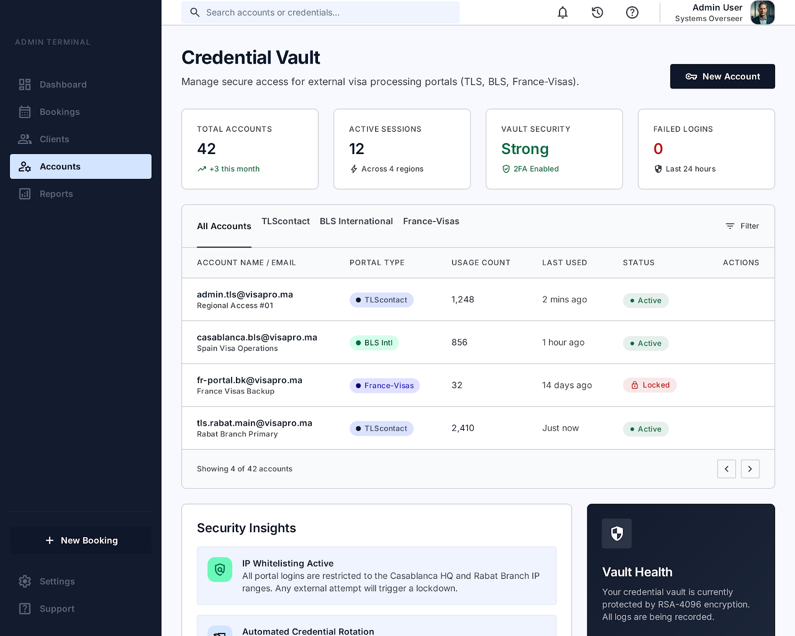

🚀 AI Visa Booking System — Premium SaaS

<p align="center">
  
</p>

<p align="center">
  
  
  
  
</p>

---

💎 Why This System?

This is not just a dashboard.  
This is a full business engine for travel agencies.

✔ Manage clients effortlessly  
✔ Organize booking workflows  
✔ Track sessions & payments  
✔ Scale your agency like a SaaS company  

---

🖥️ Live UI Preview (Auto Generated)

📊 Dashboard  


👥 Clients Management  


📅 Booking Requests  


🌐 Session Launcher  


💳 Payments  


---

🧠 Core Features

- ⚡ Lightning-fast dashboard  
- 👥 Advanced client management  
- 📅 Booking request tracking  
- 🌐 Session-based workflow (manual booking ready)  
- 🔔 Smart notifications  
- 💳 Payment tracking  
- 📊 Real-time analytics  
- 🔐 Enterprise security  

---

🏗️ Tech Stack

| Layer      | Technology |
|------------|------------|
| Frontend   | Next.js + Tailwind |
| Backend    | NestJS (TypeScript) |
| Database   | MySQL + Prisma |
| Queue      | Redis + BullMQ |
| DevOps     | Docker + CI/CD |

---

💰 Turn This Into Revenue

This system is built to sell.

✔ Offer booking services  
✔ Charge per appointment  
✔ Sell subscriptions to agencies  
✔ Scale globally  

---

🔥 Buy Now (Instant Contact)

<p align="center">
  <a href="https://wa.me/201286016083">
    
  </a>
</p>

<p align="center">
  ⚡ Limited slots available — Contact now before demand increases
</p>

---
---

<p align="center">
  
</p>

## 🧠 System Intelligence Layer

<p align="center">
  
</p>

---

## 🧩 Supported Systems

<p align="center">
  
  
  
</p>

---

## 🛠️ Tech Stack Animation View

### ⚡ Frontend
<p>
  
  
  
</p>

### 🔥 Backend
<p>
  
  
  
</p>

### 🗄️ Database & Infra
<p>
  
  
  
  
</p>

---

## 🌐 System Architecture Flow

<p align="center">
  
</p>

⚙️ Installation

```bash
git clone https://github.com/OnlineUnknowns/Morocco-Schengen-Booking-Intelligence-System.git
cd Morocco-Schengen-Booking-Intelligence-System
docker-compose up --build

---

🧩 Supported Visa Systems

This platform is designed to support automated and semi-automated appointment booking systems for:

- 🟦 BLS International (Visa Application Centers)
- 🟪 VFS Global (Visa Processing Centers)
- 🌍 Other embassy appointment systems (extensible architecture)

The system is built with a modular backend to allow integration with multiple visa providers depending on region and embassy rules.

---

🛠️ Technologies Used

This system is built using modern full-stack technologies:

### Frontend
- Next.js (React Framework)
- Tailwind CSS
- TypeScript

### Backend
- NestJS (Node.js Framework)
- REST API Architecture
- TypeScript

### Database
- MySQL
- Prisma ORM

### Infrastructure & DevOps
- Docker
- CI/CD Pipelines
- Redis (Queue & Sessions)

### Architecture
- Microservices-ready structure
- Scalable SaaS architecture
- Modular booking engine

---

🚀 System Overview

This is a complete AI-powered visa booking management system designed for travel agencies.

It enables:

✔ Automated booking workflow management  
✔ Client tracking and management  
✔ Appointment scheduling system  
✔ Multi-provider support (BLS / VFS)  
✔ Scalable SaaS deployment  

The system is designed to be production-ready and scalable for real-world travel agencies.

---
